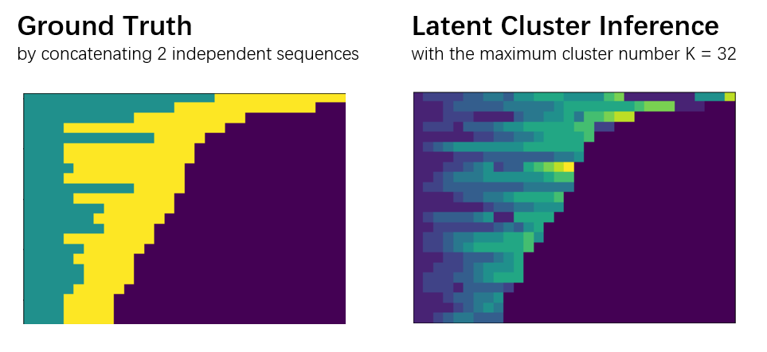

# Deep Sequential Clustering



We propose a fully differentiable **VAE**-based deep clustering framework for sequential data, and (neural) temporal point process (**TPP**) as a mathematical tool is used to model the probabilitiy of sequential data. With such a framework an event sequence can be decomposed to different highly correlated subsequences (i.e. clusters) unsupervisedly, and the encoder (inference, or posterior), regularization (or prior), decoder (reconstruction, or likelihood), and learning objective (or the ELBO in VAE context) can be abstracted as below:

```Python
q(Z|X) = Seq2Seq(X)
p(Z)   = Uniform(K)
p(X|Z) = \prod_{k=1}^K TPP(X_k)
ELBO   = E_{Z ~ q(Z|X)}[log p(X|Z)] - KL[q(Z|X) || p(Z)]

```
where **X** is the input sequence, **Z** is the categorical 1-of-K decomposition plan, and **X_k** is the k-th subsequence.

In this repo we implement modules:

- neural event embedding ([models/eemb.py](models/eemb.py))
- neural temporal point process ([models/tpp.py](models/tpp.py))
- cluster aware self attention & transformer ([models/ctfm.py](models/ctfm.py))


### Reference

- Auto-Encoding Variational Bayes (ICLR 2014)
- Neural Relational Inference for Interacting Systems (ICML 2018)
- Transformer Hawkes Process (ICML 2020)
- c-NTPP: Learning Cluster-Aware Neural Temporal Point Process (AAAI 2023)

Please refer to [Google Drive link](https://drive.google.com/drive/folders/0BwqmV0EcoUc8UklIR1BKV25YR1U?resourcekey=0-OrlU87jyc1m-dVMmY5aC4w&usp=sharing) for real-world event sequence datasets.
